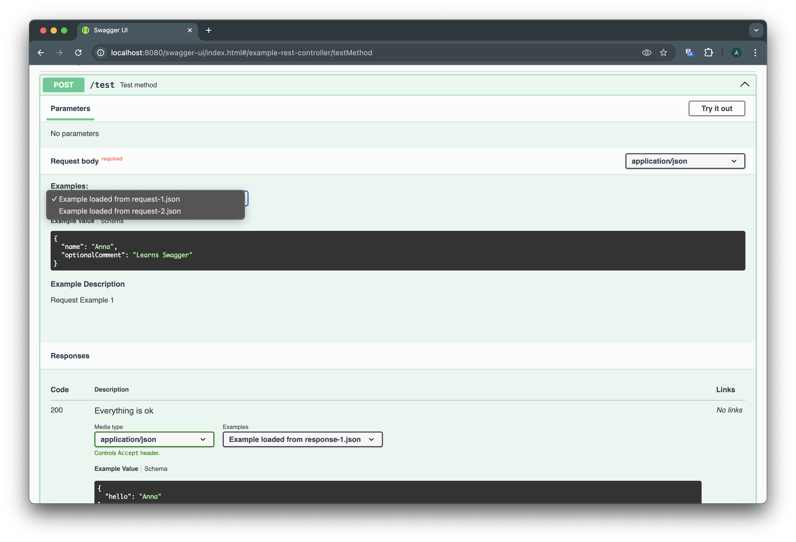
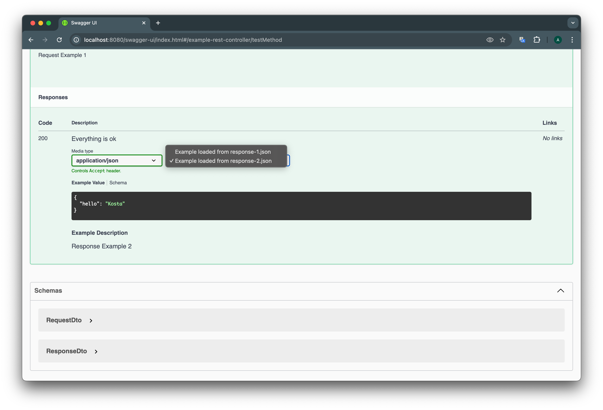

# Load Swagger Example From File

Support for loading example from file in **Code-first** approach.

## Expected Result

```java
@ExampleObject(
   name = "Response Example 1",
   summary = "Example loaded from response-1.json",
   value = "file:src/main/resources/examples/response-1.json"
)
```




Links:
* [Swagger UI]()
* [Open API JSON](http://localhost:8080/v3/api-docs)
* [Open API YAML](http://localhost:8080/v3/api-docs.yaml)

## Try It Out

1. Build the project:

```bash
./mvnw clean install
```

2. Start the app:

```bash
./mvnw spring-boot:run
```

3. Navigate to [Swagger UI](http://localhost:8080/swagger-ui/index.html#/example-rest-controller/testMethod)

## References

1. [13.28. How can I customise the OpenAPI object ?](https://springdoc.org/#how-can-i-customise-the-openapi-object)
2. [SpringDocTestApp.java](https://github.com/springdoc/springdoc-openapi/blob/main/springdoc-openapi-starter-webflux-api/src/test/java/test/org/springdoc/api/app39/SpringDocTestApp.java)
